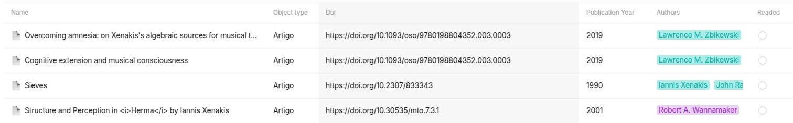

# Examples

## Hello World 

!!! quote "Hello World Example" 
    ``` python
    from anytype import Anytype
    from anytype import Object

    # Need Anytype-0.44.13-beta or higher
    # Auth, on first type you need to type the 4 digit code that will popup on Anytype App
    any = Anytype()
    any.auth()

    # Get Spaces
    spaces = any.get_spaces()
    my_space = spaces[0]

    # Create Object on the first space
    note_type = my_space.get_type("Page")
    new_object = Object()
    new_object.name = "Hello World!"
    new_object.icon = "🐍"
    new_object.description = "This is an object created from Python Api"
    new_object.add_title1("Hello")
    new_object.add_title2("From")
    new_object.add_title3("Python")
    new_object.add_codeblock("print('Hello World!')", language="python")
    new_object.add_bullet("1")
    new_object.add_bullet("2")
    new_object.add_bullet("3")
    new_object.add_bullet("3")
    new_object.add_text("$x(n) = x + n$")

    # Add to my_space
    created_object = my_space.create_object(new_object, note_type)
    ```
    
## Collection with articles and all articles cited 

<p>
    
</p>

!!! quote "Collection with all cited articles" 
    ``` python
    import anytype
    import requests
    import time

    any = anytype.Anytype()
    any.auth()


    spaces = any.get_spaces()

    myspace = None
    for space in spaces:
        if space.name == "My Space":
            myspace = space
            break

    if myspace is None:
        myspace = any.create_space("My Space")


    article_type = None
    for type in myspace.get_types(offset=0, limit=100):
        if type.name == "Artigo":
            article_type = type

    objects = myspace.search("", article_type)

    # if type does not exist we create it
    if article_type is None:
        article_type = anytype.Type("Artigo")
        article_type.icon = anytype.Icon()  # default icon
        article_type.layout = "basic"
        article_type.plural_name = "Artigos"

        article_type.add_property("Doi", anytype.PropertyFormat.TEXT)
        article_type.add_property("Publication Year", anytype.PropertyFormat.NUMBER)
        article_type.add_property("Authors", anytype.PropertyFormat.MULTI_SELECT)
        article_type.add_property("Readed", anytype.PropertyFormat.CHECKBOX)
        article_type = myspace.create_type(article_type)

    assert isinstance(article_type, anytype.Type)


    time.sleep(2)


    def add_article(doi, recursive=False):
        url = f"https://api.crossref.org/works/{doi}"
        response = requests.get(url)

        if response.status_code == 200:
            data = response.json()

            # Article Metadata
            title = data["message"]["title"][0]
            authors = []
            for author in data.get("message", {}).get("author", []):
                if "given" not in author or "family" not in author:
                    authors.append(author["name"])
                else:
                    authors.append(f"{author['given']} {author['family']}")

            # Year and DOI of the article
            article_doi = data["message"]["URL"]
            year = data["message"]["issued"]["date-parts"][0][0]

            # Creating the article object
            obj = anytype.Object(title, article_type)
            obj.doi = article_doi
            authors = [html.unescape(author).title() for author in authors]  # fix encoding

            obj.authors = authors
            obj.publication_year = year
            obj.readed = False

            # Handle references (citations)
            references = data["message"].get("reference", [])

            if recursive:
                for reference in references:
                    ref_doi = reference.get("DOI", "")
                    if ref_doi != "":
                        add_article(ref_doi)

            myspace.create_object(obj)
            time.sleep(1)

        else:
            print(f"Error fetching article data: {response.status_code}")


    # Example usage:
    doi = "10.1080/17459737.2025.2465976"
    add_article(doi, True)
    ```
