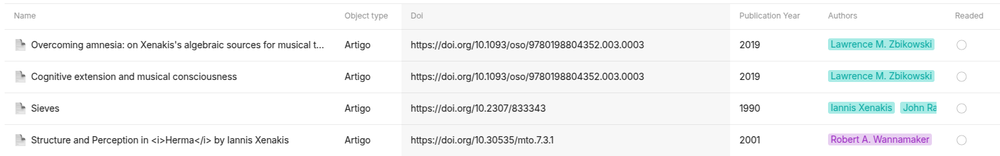

# Examples

## Zotero highlights (API v2)

The `examples/zotero2anytype.py` importer creates colored quote blocks from native
Zotero PDF annotations and highlights embedded in HTML notes. Comments, regular
notes, citations, page labels, authors, dates, and DOIs are kept as text blocks.
Standard Zotero colors map to Anytype's palette (green maps to lime); custom hex
colors use the nearest standard shade. Invalid or missing colors remain uncolored.

```bash
pip install -e '.[zotero]'
python examples/zotero2anytype.py --dry-run
python examples/zotero2anytype.py --space SPACE_ID
```

Use `--db /path/to/zotero.sqlite` for another Zotero profile, `--storage` for a
custom storage directory, and `--linked-base` for relative linked attachments.
The default database is `~/Zotero/zotero.sqlite`. The offline dry run prints v2
documents without authentication or writes. With several Anytype spaces, choose
the destination explicitly. `--type` accepts a type key and defaults to `page`.

The database is read-only. Multiple PDFs belonging to the same item produce one
page; deleted items are excluded. HTML highlights referencing an identical native
annotation are merged by annotation key. Older databases without native
annotations fall back to HTML notes. Missing PDF files do not prevent importing
stored annotation text. PDF files and image-only annotations are not imported.
Each run creates new pages; it does not update previous imports.

## Hello World

??? example "Hello World Example" 
    ``` python
    from anytype import Anytype, Object

    client = Anytype()
    client.auth()

    spaces = client.get_spaces()
    my_space = spaces[0]

    note_type = my_space.get_type_byname("Page")
    new_object = Object("Hello World!", type=note_type)
    new_object.icon = "🐍"
    new_object.description = "Created from the Anytype Python API"
    new_object.add_title1("Hello")
    new_object.add_codeblock("print('Hello World!')", language="python")

    created_object = my_space.create_object(new_object)
    ```

## Templates and custom properties

Properties linked to the selected type can be assigned by their API key or their
normalized display name:

```python
from anytype import Anytype, Object

client = Anytype()
client.auth()
my_space = client.get_spaces()[0]

quote_type = my_space.get_type_byname("Quote")
template = quote_type.get_template_byname("Quote Template")
person = my_space.search("Ada Lovelace", limit=30)[0]

obj = Object("A quote", type=quote_type, template=template)
obj.date = "02/06/2026"
obj.people = [person]

created = my_space.create_object(obj)
```

The `people` property in this example uses the `objects` format. Select and
multi-select properties accept tag names or `Tag` objects instead.

See the runnable [custom property example](https://github.com/charlesneimog/anytype-client/blob/main/examples/custom-properties.py).

## API 2025-11-08

The runnable [API reference example](https://github.com/charlesneimog/anytype-client/blob/main/examples/api-2025-11-08.py)
shows listing spaces, objects, chats, members, properties, tags, types, and templates;
global search; optional file upload; and adding an existing object to a list.

```bash
python examples/api-2025-11-08.py --space "My Space" --type "Page" --query "roadmap"
```

## Collection with articles and all articles cited 

<p>
    <a href="../assets/doi-article.png">
        
    </a>
</p>

??? example "Collection with all cited articles" 
    ``` python
    import html
    import time

    import anytype
    import requests

    any = anytype.Anytype()
    any.auth()


    spaces = any.get_spaces()

    myspace = None
    for space in spaces:
        if space.name == "My Space":
            myspace = space
            break

    if myspace is None:
        myspace = any.create_space("My Space")


    article_type = None
    for type in myspace.get_types(offset=0, limit=100):
        if type.name == "Artigo":
            article_type = type

    # if type does not exist we create it
    if article_type is None:
        article_type = anytype.Type("Artigo")
        article_type.icon = anytype.Icon()  # default icon
        article_type.layout = "basic"
        article_type.plural_name = "Artigos"

        article_type.add_property(anytype.property.Text("Doi"))
        article_type.add_property(anytype.property.Number("Publication Year"))
        article_type.add_property(anytype.property.MultiSelect("Authors"))
        article_type.add_property(anytype.property.Checkbox("Readed"))
        article_type = myspace.create_type(article_type)

    assert isinstance(article_type, anytype.Type)


    time.sleep(2)


    def add_article(doi, recursive=False):
        url = f"https://api.crossref.org/works/{doi}"
        response = requests.get(url)

        if response.status_code == 200:
            data = response.json()

            # Article Metadata
            title = data["message"]["title"][0]
            authors = []
            for author in data.get("message", {}).get("author", []):
                if "given" not in author or "family" not in author:
                    authors.append(author["name"])
                else:
                    authors.append(f"{author['given']} {author['family']}")

            # Year and DOI of the article
            article_doi = data["message"]["URL"]
            year = data["message"]["issued"]["date-parts"][0][0]

            # Creating the article object
            obj = anytype.Object(title, article_type)
            obj.doi = article_doi
            authors = [html.unescape(author).title() for author in authors]  # fix encoding

            obj.authors = authors
            obj.publication_year = year
            obj.readed = False

            # Handle references (citations)
            references = data["message"].get("reference", [])

            if recursive:
                for reference in references:
                    ref_doi = reference.get("DOI", "")
                    if ref_doi != "":
                        add_article(ref_doi)

            myspace.create_object(obj)
            time.sleep(1)

        else:
            print(f"Error fetching article data: {response.status_code}")


    # Example usage:
    doi = "10.1080/17459737.2025.2465976"
    add_article(doi, True)
    ```
